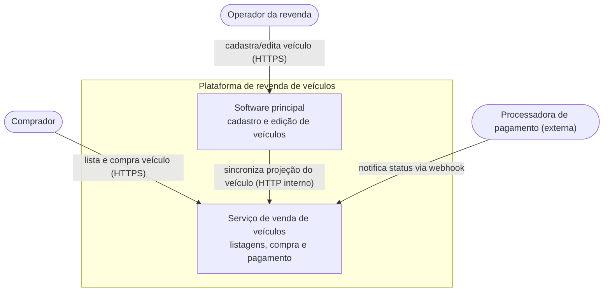
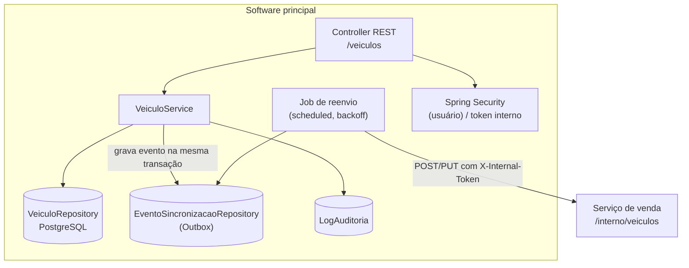
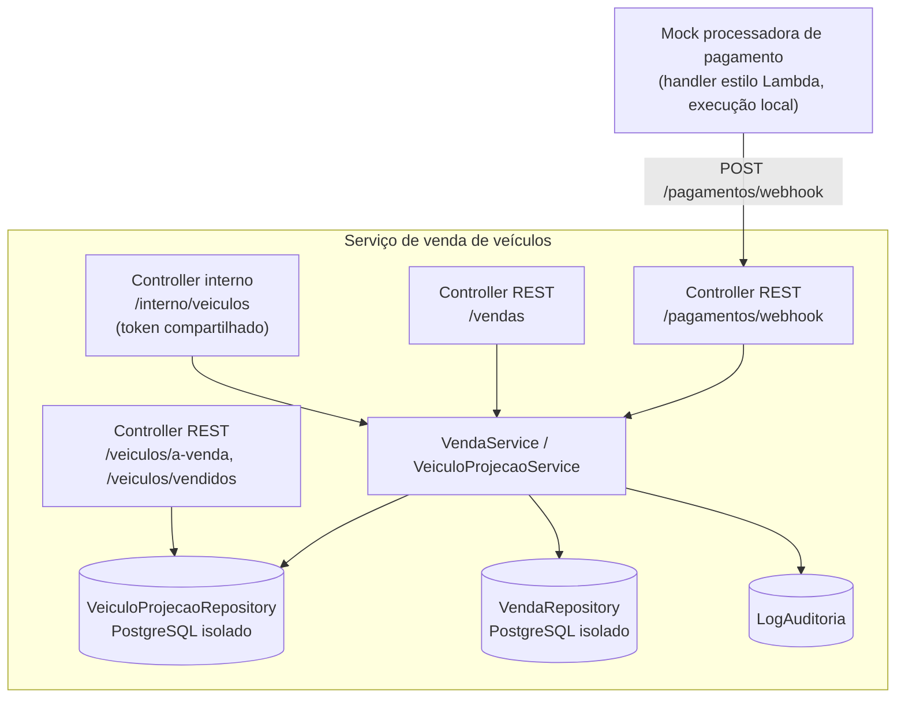
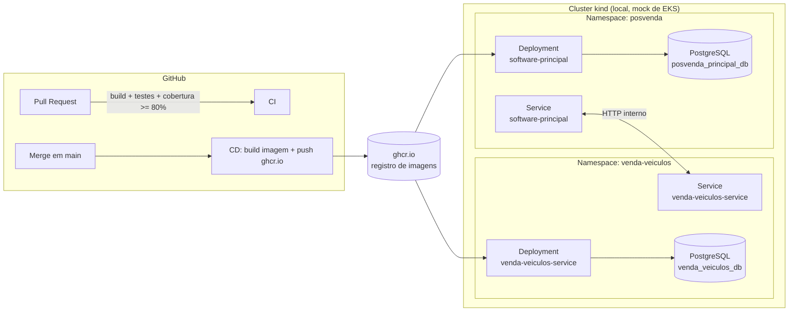
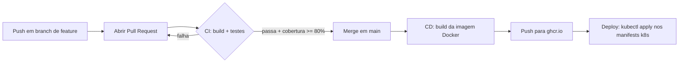

# HLD — High-Level Design

Visão de alto nível da solução: contexto, componentes por serviço, integração e infraestrutura de
deploy. Para o detalhamento de classes, entidades e sequências, ver [`lld.md`](./lld.md). Para o
porquê de cada escolha, ver [`decisoes-pendentes.md`](./decisoes-pendentes.md).

## Diagrama de contexto

## Componentes — Software principal

## Componentes — Serviço de venda de veículos

## Infraestrutura de deploy

Cada serviço é empacotado como imagem Docker e publicado no GitHub Container Registry
(`ghcr.io`) no merge para `main`. O deploy é demonstrado localmente com **`kind`**
(Kubernetes-in-Docker), aplicando os mesmos manifests (`Deployment` + `Service`) que valeriam em
um cluster gerenciado real — ver decisão nº 7 em `decisoes-pendentes.md`.

## CI/CD por repositório

