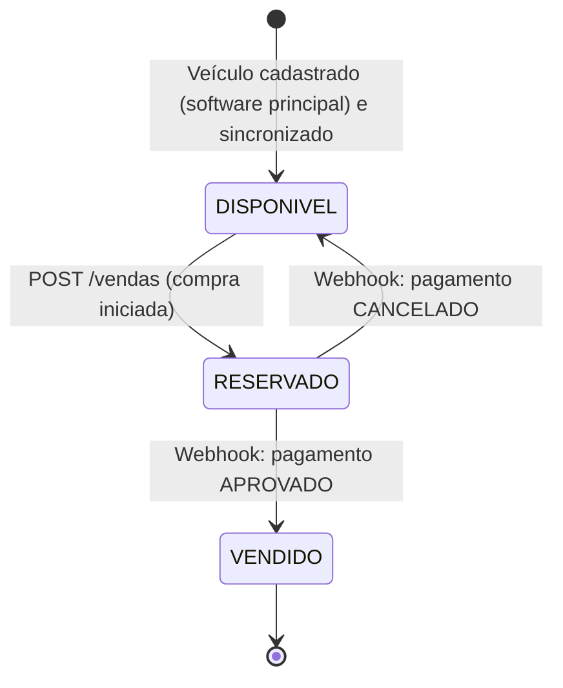
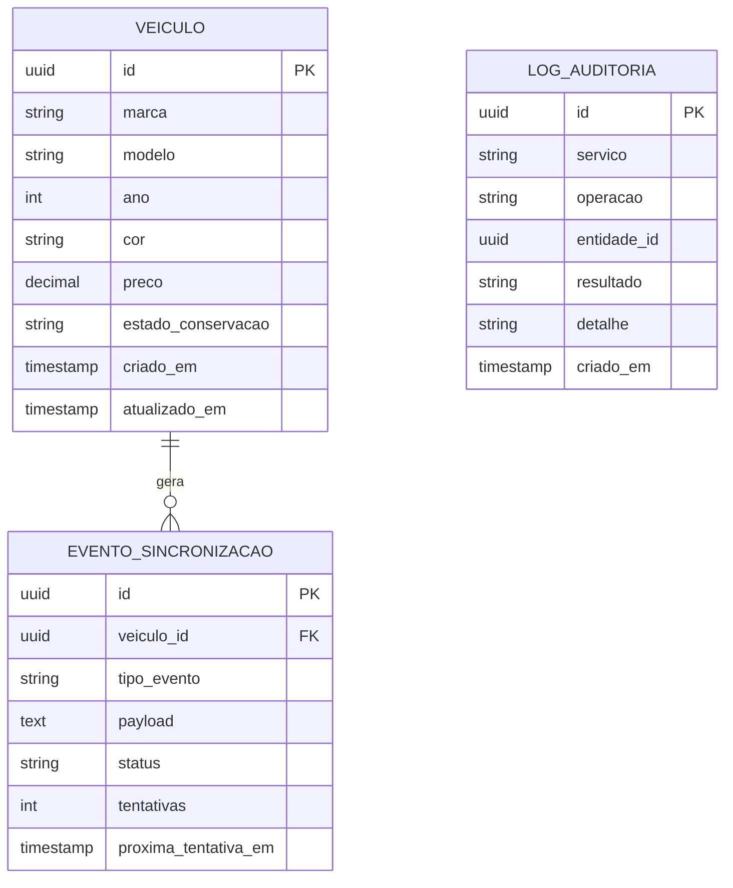
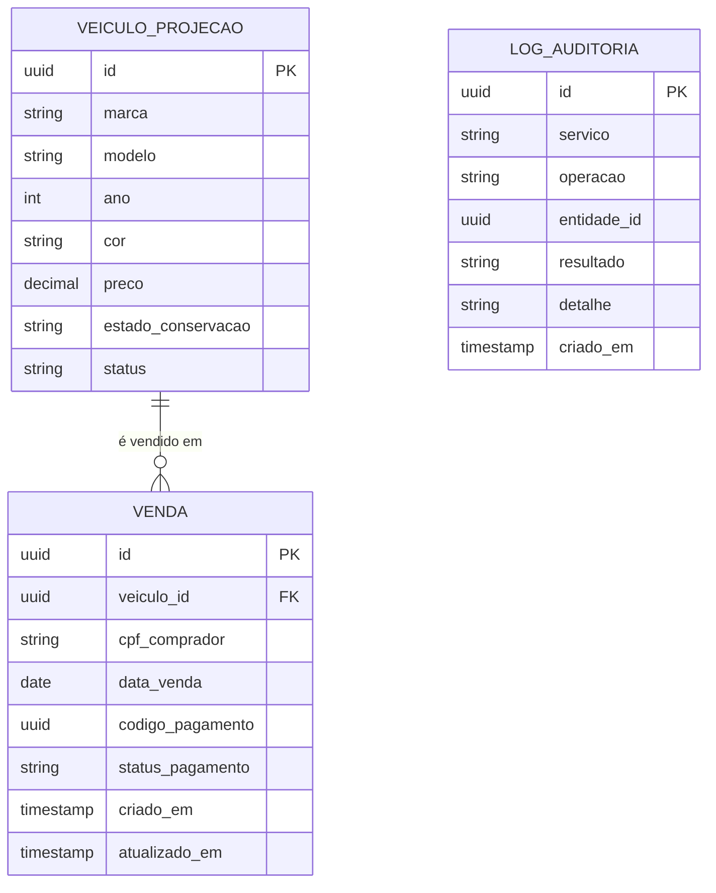
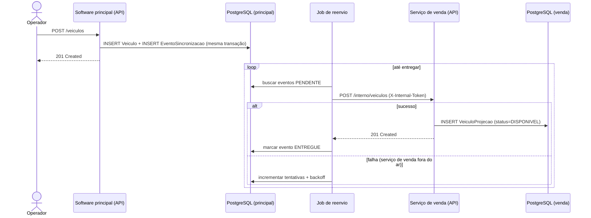
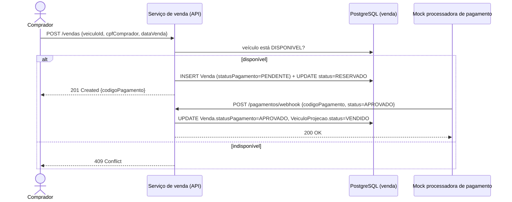
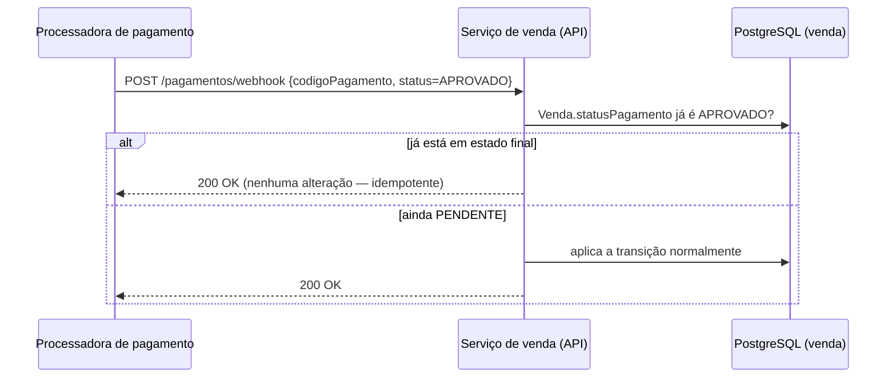
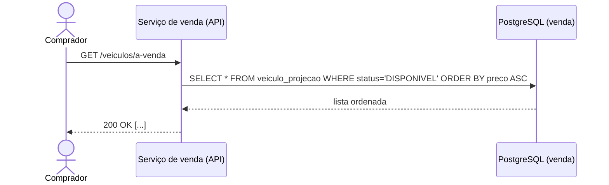

# LLD — Low-Level Design

Detalhamento de classes, entidades, banco de dados e sequências de cada fluxo de negócio. Este é
o **desenho que o código deve seguir** — a implementação ainda está em andamento (ver
`decisoes-pendentes.md`, item 11). Para a visão de componentes e infraestrutura, ver
[`hld.md`](./hld.md).

## Fluxograma da aplicação (ciclo de vida do veículo/venda)

## Diagrama de classes — Software principal

O software principal segue Arquitetura Hexagonal (Ports & Adapters): as classes abaixo estão
agrupadas por camada (Domain, Application, Ports, Adapters), refletindo os pacotes reais do código
(`veiculo.domain`, `veiculo.application`, `veiculo.adapter.*`, e o mesmo padrão para
`sincronizacao` e `auditoria`).

```mermaid
classDiagram
    %% Domain — sem Spring/JPA/HTTP
    class Veiculo {
        <<domain>>
        +UUID id
        +String marca
        +String modelo
        +Integer ano
        +String cor
        +BigDecimal preco
        +EstadoConservacao estadoConservacao
        +Instant criadoEm
        +Instant atualizadoEm
    }

    class EstadoConservacao {
        <<enumeration>>
        NOVO
        SEMINOVO
        USADO
    }

    class EventoSincronizacao {
        <<domain>>
        +UUID id
        +UUID veiculoId
        +TipoEvento tipoEvento
        +String payload
        +StatusEvento status
        +Integer tentativas
        +Instant proximaTentativaEm
        +marcarEntregue() void
        +registrarFalha(Duration) void
    }

    class TipoEvento {
        <<enumeration>>
        VEICULO_CRIADO
        VEICULO_ATUALIZADO
    }

    class StatusEvento {
        <<enumeration>>
        PENDENTE
        ENTREGUE
        FALHOU_DEFINITIVAMENTE
    }

    %% Application — Ports (in/out) e Use Cases
    class CadastrarVeiculoUseCase {
        <<port in>>
        +cadastrar(DadosVeiculo) Veiculo
    }

    class EditarVeiculoUseCase {
        <<port in>>
        +editar(UUID, DadosVeiculo) Veiculo
    }

    class VeiculoRepositoryPort {
        <<port out>>
        +save(Veiculo) Veiculo
        +findById(UUID) Optional~Veiculo~
    }

    class EventoSincronizacaoRepositoryPort {
        <<port out>>
        +save(EventoSincronizacao) EventoSincronizacao
        +findByStatusAndProximaTentativaEmLessThanEqual(...) List~EventoSincronizacao~
    }

    class SincronizacaoEventoPort {
        <<port out>>
        +registrarEvento(Veiculo, TipoEvento) void
    }

    class VendaVeiculosSyncPort {
        <<port out>>
        +sincronizar(TipoEvento, UUID, VeiculoSyncPayload) boolean
    }

    class AuditoriaPort {
        <<port out>>
        +registrarSucesso(String, UUID, String) void
        +registrarErro(String, UUID, String) void
    }

    class CadastrarVeiculoService {
        <<application>>
    }
    class EditarVeiculoService {
        <<application>>
    }
    class SincronizacaoService {
        <<application>>
    }
    class ReenviarEventosPendentesService {
        <<application>>
        backoff exponencial, MAX_TENTATIVAS=10
    }

    %% Adapters
    class VeiculoController {
        <<adapter in/web>>
        +cadastrar(VeiculoRequest) VeiculoResponse
        +editar(UUID, VeiculoRequest) VeiculoResponse
    }

    class SincronizacaoJob {
        <<adapter in/scheduler>>
        +reenviarPendentes() void
    }

    class VeiculoPersistenceAdapter {
        <<adapter out/persistence>>
    }

    class EventoSincronizacaoPersistenceAdapter {
        <<adapter out/persistence>>
    }

    class HttpVendaVeiculosAdapter {
        <<adapter out/http>>
    }

    class AuditoriaPersistenceAdapter {
        <<adapter out/persistence>>
    }

    Veiculo --> EstadoConservacao
    EventoSincronizacao --> TipoEvento
    EventoSincronizacao --> StatusEvento
    CadastrarVeiculoService ..|> CadastrarVeiculoUseCase
    EditarVeiculoService ..|> EditarVeiculoUseCase
    SincronizacaoService ..|> SincronizacaoEventoPort
    ReenviarEventosPendentesService --> VendaVeiculosSyncPort
    ReenviarEventosPendentesService --> AuditoriaPort
    CadastrarVeiculoService --> VeiculoRepositoryPort
    CadastrarVeiculoService --> SincronizacaoEventoPort
    CadastrarVeiculoService --> AuditoriaPort
    VeiculoController --> CadastrarVeiculoUseCase
    VeiculoController --> EditarVeiculoUseCase
    VeiculoPersistenceAdapter ..|> VeiculoRepositoryPort
    EventoSincronizacaoPersistenceAdapter ..|> EventoSincronizacaoRepositoryPort
    ReenviarEventosPendentesService --> EventoSincronizacaoRepositoryPort
    SincronizacaoService --> EventoSincronizacaoRepositoryPort
    HttpVendaVeiculosAdapter ..|> VendaVeiculosSyncPort
    AuditoriaPersistenceAdapter ..|> AuditoriaPort
    SincronizacaoJob --> ReenviarEventosPendentesService
```

## Diagrama de classes — Serviço de venda de veículos

O serviço de venda segue a mesma Arquitetura Hexagonal do software principal. `VeiculoProjecao` e
`Venda` são agregados de Domain com comportamento próprio (não apenas dados): a decisão de quando
um veículo pode ser reservado, vendido ou liberado, e quando uma venda pode ser aprovada ou
cancelada, vive nos próprios objetos de domínio — não mais em métodos soltos do antigo
`VendaService`.

```mermaid
classDiagram
    %% Domain — sem Spring/JPA/HTTP
    class VeiculoProjecao {
        <<domain>>
        +UUID id
        +String marca
        +String modelo
        +Integer ano
        +String cor
        +BigDecimal preco
        +EstadoConservacao estadoConservacao
        +StatusVeiculo status
        +Long versao
        +estaDisponivel() boolean
        +reservar() void
        +marcarVendido() void
        +liberar() void
        +atualizarDadosCadastrais(...) void
    }

    class StatusVeiculo {
        <<enumeration>>
        DISPONIVEL
        RESERVADO
        VENDIDO
    }

    class VeiculoIndisponivelException {
        <<domain exception>>
    }

    class Venda {
        <<domain>>
        +UUID id
        +UUID veiculoId
        +String cpfComprador
        +LocalDate dataVenda
        +UUID codigoPagamento
        +StatusPagamento statusPagamento
        +Instant criadoEm
        +Instant atualizadoEm
        +estaEmEstadoFinal() boolean
        +aprovar() void
        +cancelar() void
    }

    class StatusPagamento {
        <<enumeration>>
        PENDENTE
        APROVADO
        CANCELADO
    }

    class CpfValidador {
        <<domain>>
        +isValido(String) boolean
    }

    class CpfInvalidoException {
        <<domain exception>>
    }

    %% Application — Ports (in/out) e Use Cases
    class CriarProjecaoVeiculoUseCase { <<port in>> }
    class AtualizarProjecaoVeiculoUseCase { <<port in>> }
    class ListarVeiculosAVendaUseCase { <<port in>> }
    class ListarVeiculosVendidosUseCase { <<port in>> }
    class EfetuarVendaUseCase { <<port in>> }
    class ProcessarWebhookPagamentoUseCase { <<port in>> }

    class VeiculoProjecaoRepositoryPort { <<port out>> }
    class VendaRepositoryPort { <<port out>> }
    class AuditoriaPort { <<port out>> }

    class VeiculoProjecaoService {
        <<application>>
    }
    class VendaService {
        <<application>>
    }
    class VeiculoNaoEncontradoException {
        <<application exception>>
    }
    class PagamentoNaoEncontradoException {
        <<application exception>>
    }

    %% Adapters
    class VeiculoInternoController {
        <<adapter in/web>>
        +criar(VeiculoSyncRequest) VeiculoResponse
        +atualizar(UUID, VeiculoSyncRequest) VeiculoResponse
    }

    class VeiculoListagemController {
        <<adapter in/web>>
        +listarAVenda() List~VeiculoResponse~
        +listarVendidos() List~VeiculoResponse~
    }

    class VendaController {
        <<adapter in/web>>
        +efetuarVenda(VendaRequest) VendaResponse
    }

    class WebhookPagamentoController {
        <<adapter in/web>>
        +receber(WebhookRequest) void
    }

    class VeiculoProjecaoPersistenceAdapter { <<adapter out/persistence>> }
    class VendaPersistenceAdapter { <<adapter out/persistence>> }
    class AuditoriaPersistenceAdapter { <<adapter out/persistence>> }

    VeiculoProjecao --> StatusVeiculo
    VeiculoProjecao --> EstadoConservacao
    VeiculoProjecao --> VeiculoIndisponivelException
    Venda --> StatusPagamento
    VendaService --> CpfValidador
    VendaService --> CpfInvalidoException
    VeiculoProjecaoService ..|> CriarProjecaoVeiculoUseCase
    VeiculoProjecaoService ..|> AtualizarProjecaoVeiculoUseCase
    VeiculoProjecaoService ..|> ListarVeiculosAVendaUseCase
    VeiculoProjecaoService ..|> ListarVeiculosVendidosUseCase
    VeiculoProjecaoService --> VeiculoProjecaoRepositoryPort
    VeiculoProjecaoService --> AuditoriaPort
    VeiculoProjecaoService --> VeiculoNaoEncontradoException
    VendaService ..|> EfetuarVendaUseCase
    VendaService ..|> ProcessarWebhookPagamentoUseCase
    VendaService --> VendaRepositoryPort
    VendaService --> VeiculoProjecaoRepositoryPort
    VendaService --> AuditoriaPort
    VendaService --> PagamentoNaoEncontradoException
    VeiculoInternoController --> CriarProjecaoVeiculoUseCase
    VeiculoInternoController --> AtualizarProjecaoVeiculoUseCase
    VeiculoListagemController --> ListarVeiculosAVendaUseCase
    VeiculoListagemController --> ListarVeiculosVendidosUseCase
    VendaController --> EfetuarVendaUseCase
    WebhookPagamentoController --> ProcessarWebhookPagamentoUseCase
    VeiculoProjecaoPersistenceAdapter ..|> VeiculoProjecaoRepositoryPort
    VendaPersistenceAdapter ..|> VendaRepositoryPort
    AuditoriaPersistenceAdapter ..|> AuditoriaPort
```

## Modelo de dados (ER) — Software principal

## Modelo de dados (ER) — Serviço de venda de veículos

## Sequência — Cadastrar veículo (com sincronização resiliente)

## Sequência — Efetuar venda e confirmação de pagamento

## Sequência — Webhook chamado novamente (idempotência)

## Sequência — Listagem de veículos à venda

