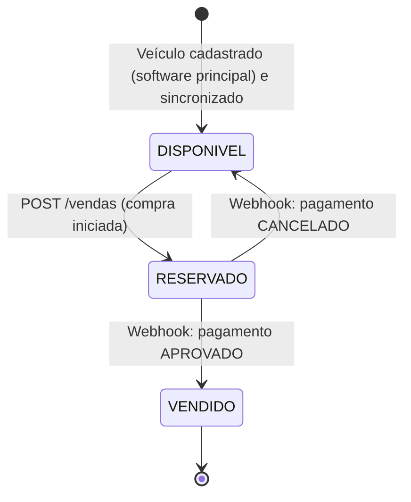
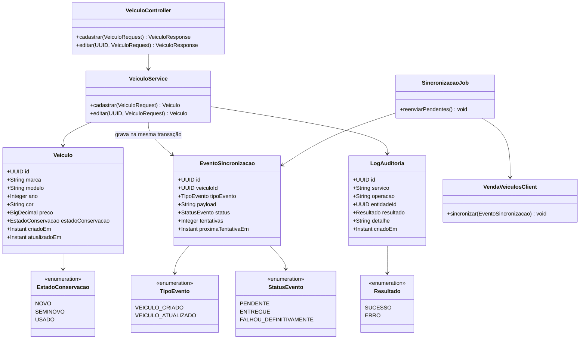
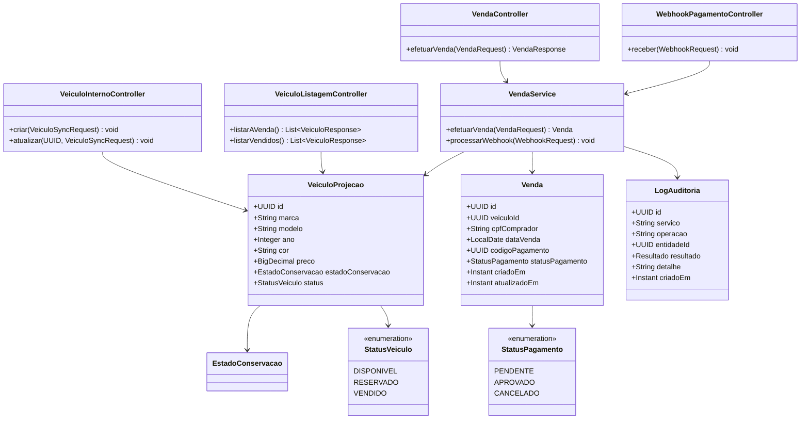
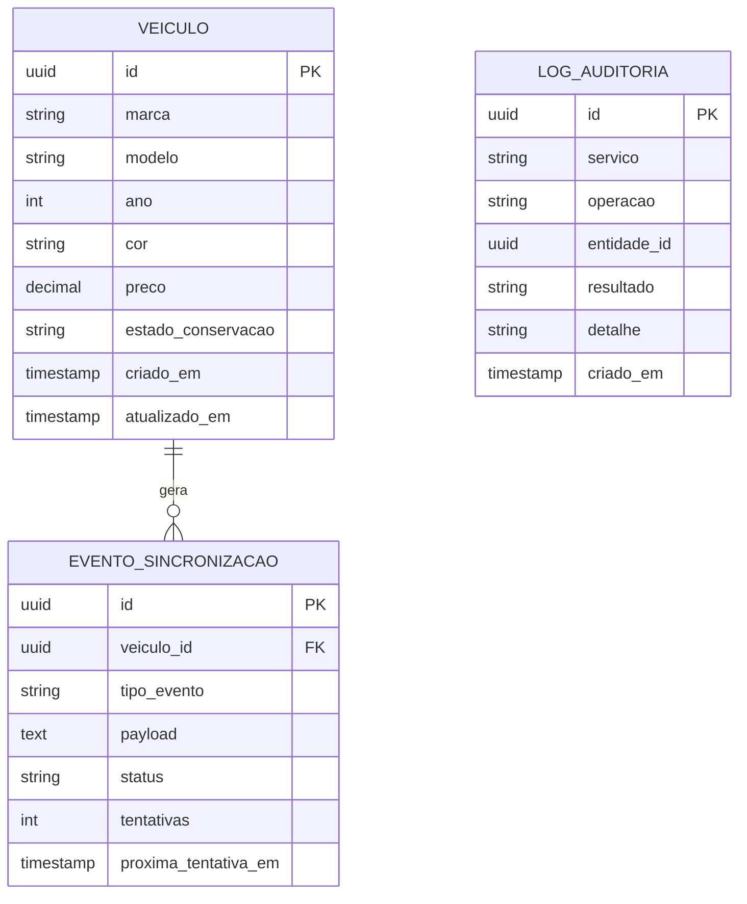
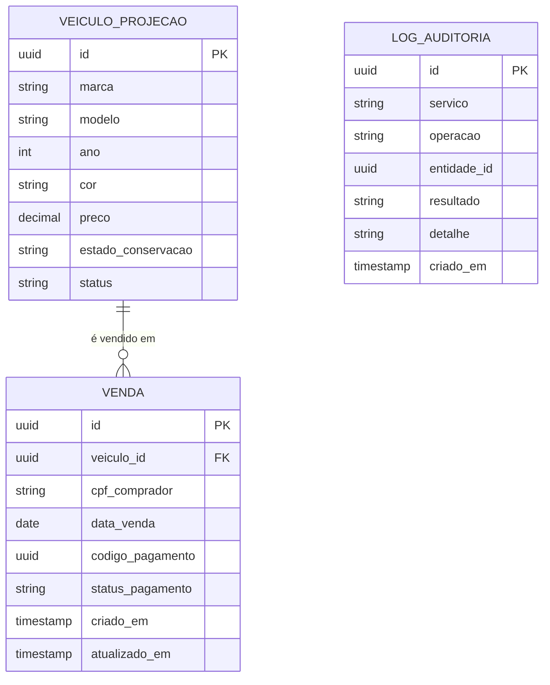
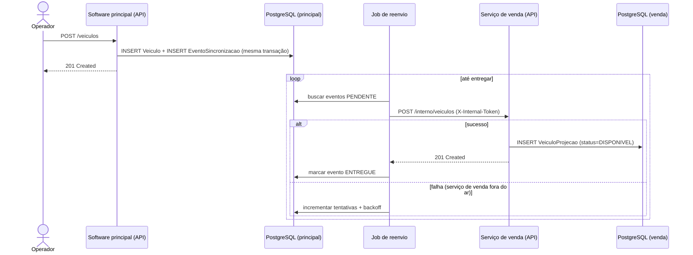
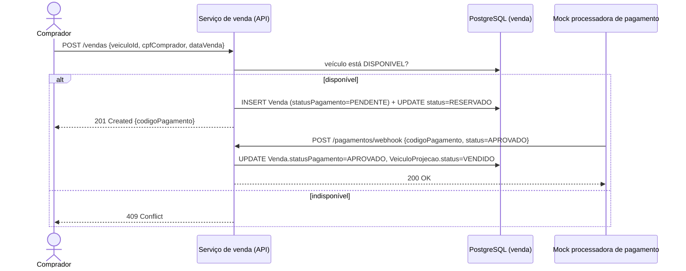
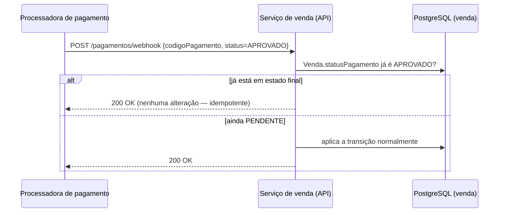
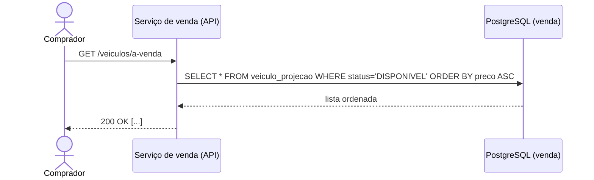

# LLD — Low-Level Design

Detalhamento de classes, entidades, banco de dados e sequências de cada fluxo de negócio. Este é
o **desenho que o código deve seguir** — a implementação ainda está em andamento (ver
`decisoes-pendentes.md`, item 11). Para a visão de componentes e infraestrutura, ver
[`hld.md`](./hld.md).

## Fluxograma da aplicação (ciclo de vida do veículo/venda)

## Diagrama de classes — Software principal

## Diagrama de classes — Serviço de venda de veículos

## Modelo de dados (ER) — Software principal

## Modelo de dados (ER) — Serviço de venda de veículos

## Sequência — Cadastrar veículo (com sincronização resiliente)

## Sequência — Efetuar venda e confirmação de pagamento

## Sequência — Webhook chamado novamente (idempotência)

## Sequência — Listagem de veículos à venda

